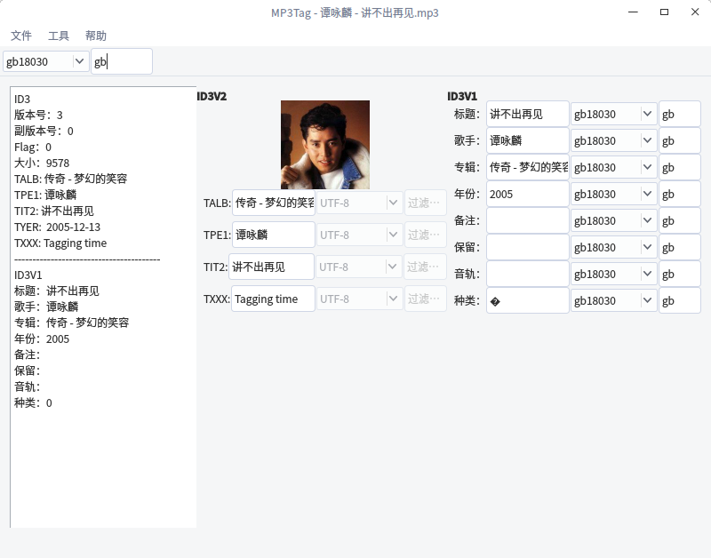

# Qt: MP3Tag
一个基于 Qt 的 Mp3 文件 ID3信息读取程序。  

### [MP3文件结构](https://blog.csdn.net/fulinwsuafcie/article/details/8972346)
<table>
<tr><td>ID3V2</td></tr>
<tr><td>Frame . . . Frame</td></tr>
<tr><td>ID3V1</td></tr>
</table>

### ID3V1
位于MP3文件末尾的128字节。  
<table>
<tr><td>长度(字节)</td><td>说明</td></tr>
<tr><td>3</td><td>"TAG"标识符(不含则没有ID3V1)</td></tr>
<tr><td>30</td><td>歌名</td></tr>
<tr><td>30</td><td>歌手</td></tr>
<tr><td>30</td><td>专辑</td></tr>
<tr><td>4</td><td>年份</td></tr>
<tr><td>28</td><td>备注</td></tr>
<tr><td>1</td><td>保留</td></tr>
<tr><td>1</td><td>音轨</td></tr>
<tr><td>1</td><td>类别</td></tr>
</table>

### ID3V2
ID3V2 位置在 MP3 文件的开头，长度不定，由一个标签头和若干个标签帧或一个扩展标签头组成。  
#### 1.标签头
<table>
<tr><td>长度(字节)</td><td>说明</td></tr>
<tr><td>3</td><td>"ID3"标识符(不含则没有ID3V2)</td></tr>
<tr><td>1</td><td>版本号，ID3V2.3 就记录3</td></tr>
<tr><td>1</td><td>副版本号</td></tr>
<tr><td>1</td><td>标志</td></tr>
<tr><td>4</td><td>标签大小，包括标签头10 个字节和所有标签帧的大小</td></tr>
</table>

###### 1)标签大小计算规则
#### 2.标签帧
由10 个字节的帧头和至少一个字节的不固定长度的内容组成。  
##### 1)帧头  
<table>
<tr><td>长度(字节)</td><td>说明</td></tr>
<tr><td>4</td><td>帧标识</td></tr>
<tr><td>4</td><td>内容</td></tr>
<tr><td>2</td><td>标志</td></tr>
</table>

##### 1>帧标识

<table>
<tr><td>TIT2</td><td>标题</td></tr>
<tr><td>TPE1</td><td>歌手</td></tr>
<tr><td>TALB</td><td>专辑</td></tr>
<tr><td>TRCK</td><td>音轨格式：N/M 其中N 为专辑 中的第N 首，M为专辑 中共M 首，N和M 为ASCII 码表示的数字</td></tr>
<tr><td>TYER</td><td>年代，用ASCII 码表示的数字 </td></tr>
<tr><td>TCON</td><td>类型直接用字符串表示</td></tr>
<tr><td>COMM</td><td>备注，格式："eng\0备注内容"，其中eng 表示备注所使用的自然语言</td></tr>
</table>

##### 2> 帧大小
##### 只表示帧内容的大小，不包含帧头的10个字节。
